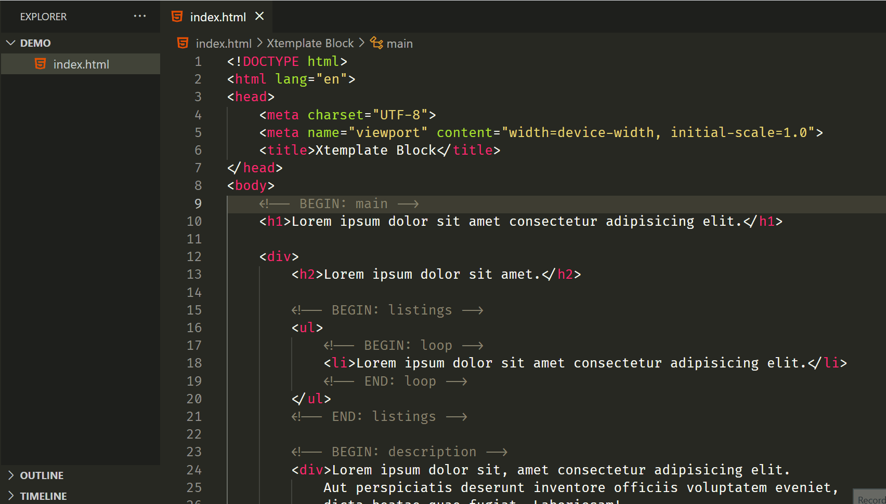

# xtemplate-block README

The `xtemplate-block` extension is designed to enhance your Visual Studio Code experience by providing powerful tools for working with XTemplate files. This extension streamlines your workflow and boosts productivity when dealing with XTemplate-based projects.

## Features

- **Provide Language Symbols**: Provide language symbols based on parsed blocknames of BEGIN-END.
- **Shrink/Expand**: Shrink/Expand your xtemplate markup block.
- **Hover for path**: Hover on the BEGIN/END tag, a path from the root tag will be shown up.

## Requirements

This extension requires Visual Studio Code version 1.70.0 or higher.

## Extension Settings

This extension contributes the following settings:

- `xtemplate-block.enable`: Enable or disable the extension.
- `xtemplate-block.validateOnSave`: Enable validation of XTemplate files on save.

## Known Issues

- Large XTemplate files may take longer to validate.
- Hover ability sometimes shows incorrect paths.

## Release Notes

### 1.0.0

- Initial release of `xtemplate-block`.
- Added language symbols, folding ranges, and hover-to-see-path ability.

---

## Following extension guidelines

Ensure that you've read through the extensions guidelines and follow the best practices for creating your extension.

- [Extension Guidelines](https://code.visualstudio.com/api/references/extension-guidelines)

## For more information

- [Visual Studio Code's Extension API](https://code.visualstudio.com/api)
- [XTemplate Documentation](https://example.com/xtemplate-docs)

**Enjoy using `xtemplate-block`!**
